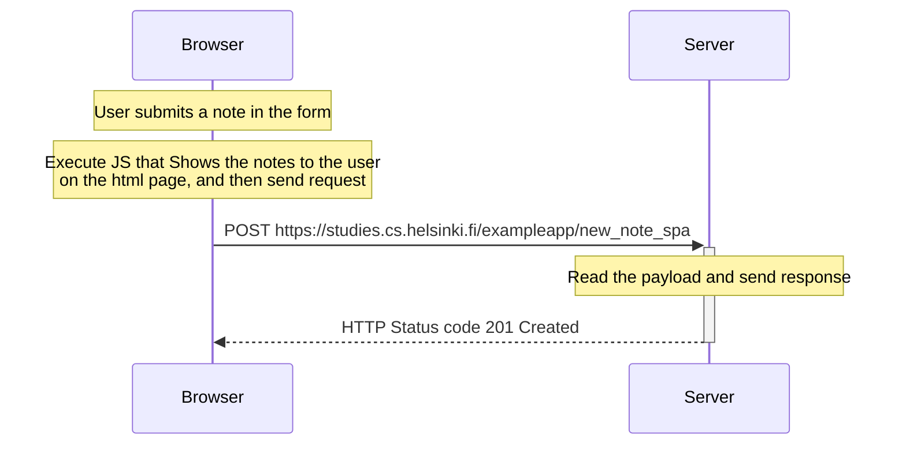

# Sequence diagram when a user creates a new note in the Single Page App version of notes app.

- Browser and Server communication flow, when a user creates a new note in [this page](https://studies.cs.helsinki.fi/exampleapp/spa).

