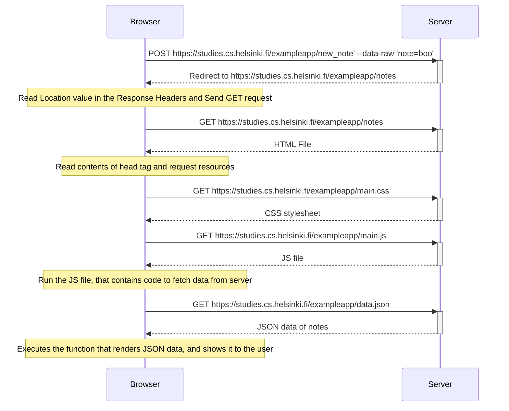

# Sequence diagram when user creates a new note

- Browser and Server communication flow, when a user creates a new note [at this page](https://studies.cs.helsinki.fi/exampleapp/notes)

```mermaid
sequenceDiagram
    participant B as Browser
    participant S as Server
    B ->>+ S : POST https://studies.cs.helsinki.fi/exampleapp/new_note' --data-raw 'note=boo'
    S -->>- B : Redirect to https://studies.cs.helsinki.fi/exampleapp/notes
    note over B : Read Location value in the Response Headers and Send GET request
    B ->>+ S : GET https://studies.cs.helsinki.fi/exampleapp/notes
    S -->>- B : HTML File
    note over B : Read contents of head tag and request resources
    B ->>+ S : GET  https://studies.cs.helsinki.fi/exampleapp/main.css
    S -->>- B : CSS stylesheet
    B ->>+ S : GET https://studies.cs.helsinki.fi/exampleapp/main.js
    S -->>- B : JS file
    note over B: Run the JS file, that contains code to fetch data from server
    B ->>+ S : GET https://studies.cs.helsinki.fi/exampleapp/data.json
    S -->>- B : JSON data of notes
    note over B: Executes the function that renders JSON data, and shows it to the user
```
