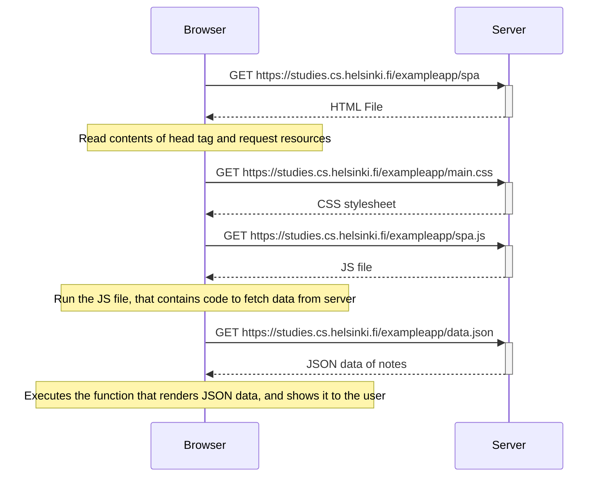

# Sequence diagram when a user goes to Single Page App version of notes app

- Browser and Server communication flow, when a user goes to [this page](https://studies.cs.helsinki.fi/exampleapp/spa).

